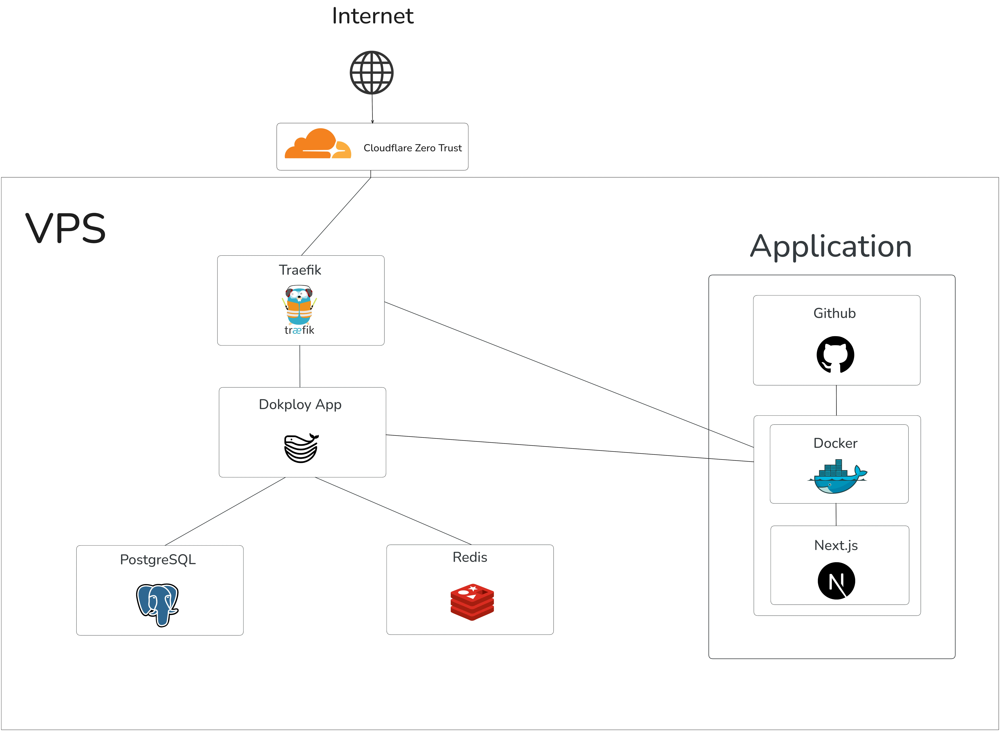
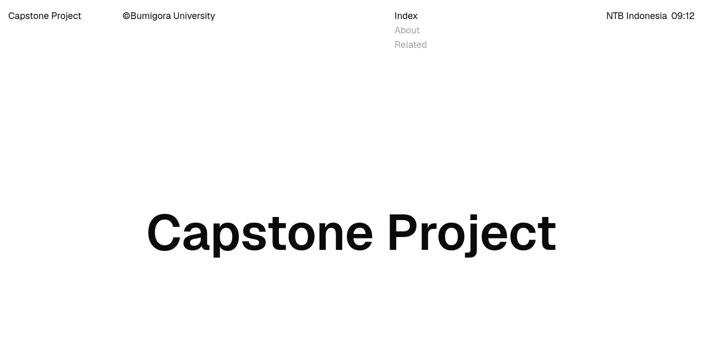
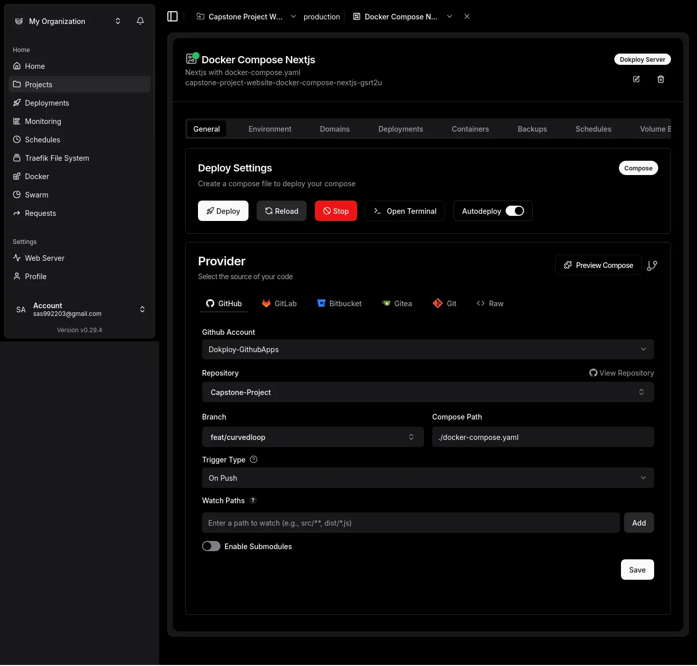
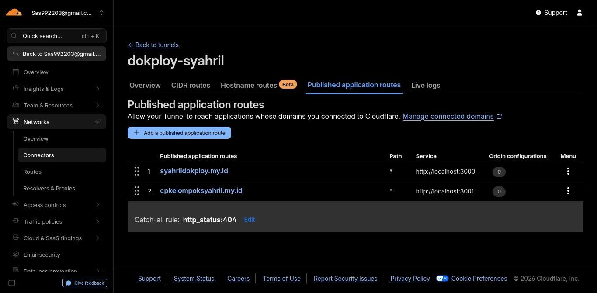
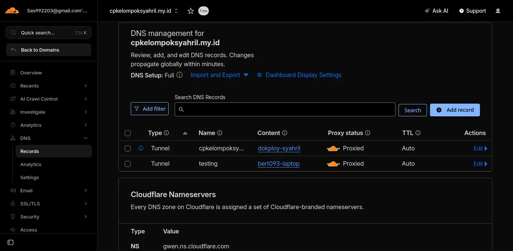
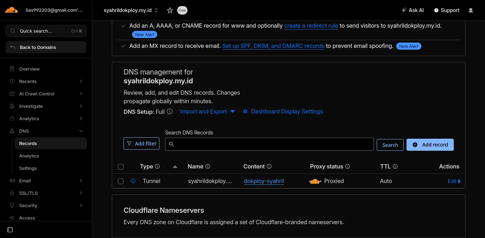

<div align="center">
<h1>Capstone Project</h1>
</div>

## Requirements

Make sure you have the following installed on your system:

```
Git (2.54.0 or newer)
Bun (1.3.13 or newer)
```

## How To Run This Project

1. Clone repository

```bash
git clone https://github.com/bert093-project/Capstone-Project
cd Capstone-Project
```

2. Install package/dependency:

```bash
bun i # (or bun install)
```

3. Run the development server:

```bash
bun dev
```

<details>
<summary>An alternative method if you're comfortable with Docker (docker-compose.yaml)</summary>

<br>

1. Install Docker

If you're using an Arch Linux-based distribution, you can install it directly by running:

```bash
sudo pacman -S docker docker-compose docker-buildx
sudo systemctl enable --now Docker.service # (Enable docker service)
sudo usermod -aG docker $USER # (configure user permission)
newgrp docker # (applying changes. MUST RESTART after doing this)
```

2. Run the docker-compose.yaml

and then you can run Docker Compose with

```bash
docker compose up -d # (Running in the background)
```

3. See the server

you can see the server active in

```bash
http://localhost:3001
```

</details>

## How It Works


### TechStack & Tools
- Next.js
- React.js
- Tailwind CSS
- Typescript
- Bun
- Docker (Dockerfile, docker-compose.yaml, .dockerignore)
- Ubuntu Server (Without Desktop Environment)
- OpenSSH (Client + Server)
- Tailscale
- Lazygit
- Lazydocker
- Dokploy
- Cloudflared (Cloudflare Tunnel)

## Project Attachments

<details>
<summary>Click here!</summary>

<br>

### Website

[Capstone Project Website](https://cpkelompoksyahril.my.id



### Dokploy (Docker Compose App)



### Cloudflare Zero Trust (Publishabled Application Routes)



### DNS Records

#### cpkelompoksyahril.my.id



#### syahrildokploy.my.id



</details>

## References

#### Cloudflare
- [github.com/cloudflare - cloudflared](https://github.com/cloudflare/cloudflared)
- [dash.cloudflare.com - Cloudflare dashboard](https://dash.cloudflare.com/)
- [developers.cloudflare.com - Create a tunnel (dashboard)](https://developers.cloudflare.com/cloudflare-one/networks/connectors/cloudflare-tunnel/get-started/create-remote-tunnel/)

#### Docker
- [docs.docker.com - Compose file referense](https://docs.docker.com/reference/compose-file)
- [docs.docker.com - Define services in Docker Compose](https://docs.docker.com/reference/compose-file/services/)
- [docs.docker.com - Compose Build Specification](https://docs.docker.com/reference/compose-file/build/)
- [hub.docker.com/cloudflared - cloudflare/cloudflared](https://hub.docker.com/r/cloudflare/cloudflared)

#### Dokploy
- [github.com/dokploy - dokploy](https://github.com/dokploy/dokploy)
- [docs.dokploy.com/docs - Installation](https://docs.dokploy.com/docs/core/installation)
- [templates.dokploy.com - Templates](https://templates.dokploy.com/)

#### Next.js
- [nextjs.org/docs - Deploying](https://nextjs.org/docs/app/getting-started/deploying)

#### ReactBits
- [reactbits.dev - Curved Loop](https://reactbits.dev/text-animations/curved-loop?curveAmount=0&interactive=false&speed=1.3&marqueeText=Capstone+Project)

#### react-live-clock
- [npmjs.com - react-live-clock](https://www.npmjs.com/package/react-live-clock)
- [github.com - react-live-clock](https://github.com/pvoznyuk/react-live-clock)
- [https://pvoznyuk.github.io/react-live-clock - React Live Clock Demo](https://pvoznyuk.github.io/react-live-clock/)

#### Timezone
- [en.wikipedia.org - List of tz database time zones](https://en.wikipedia.org/wiki/List_of_tz_database_time_zones)

#### Vercel (with-docker)
- [github.com/vercel - Next.js Docker Example - Standalone Mode](https://github.com/vercel/next.js/tree/canary/examples/with-docker)
- [github.com/vercel - Official Dockerfile specifically for project using Bun](https://github.com/vercel/next.js/blob/canary/examples/with-docker/Dockerfile.bun)
